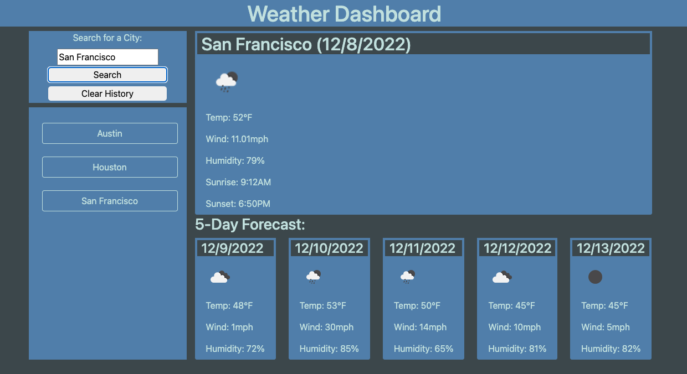

# Weather Dashboard

## Description

Application to capture current and future weather data using third party API calls and displays them in a dashboard. Saves previous searches to local storage for quick reference on subsequent visits to application.

## Table of Contents

- [Installation](#installation)
- [Usage](#Usage)
- [License](#License)
- [Contributions](#Contributions)
- [Tests](#Tests)
- [Questions](#Questions)

## Installation

How to install:
N/A

## Usage

Navigate to URL and enter city who's weather information you'd like displayed
 
 
[Link to deployed page](https://michael-alvarado.github.io/Weather-Dashboard/)
 
 

## License

## Contributions

Reach out to me.

## Tests

Steps necessary to test:
N/A

## Questions

Feel free to reach out to me if you have any questions. Contact info below:

- [GitHub](https:://github.com/Michael-Alvarado)
- Email: alvaradomike5@gmail.com
